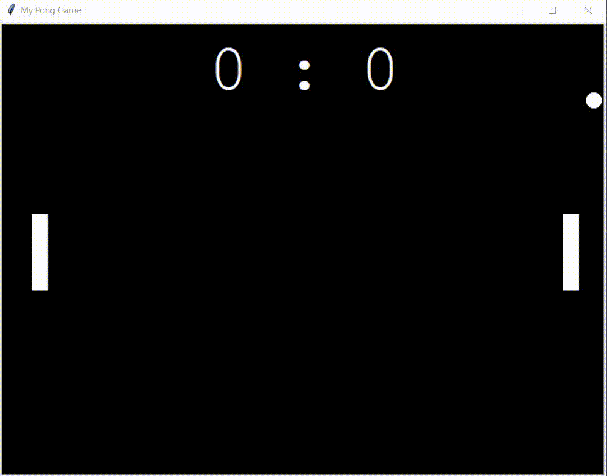

# Pong Game

I recreated the famous pong game in an object-oriented approach using Python and its Turtle module.

## Game instructions:

Use the arrow keys 'up' and 'down' (right paddle) and the keys 's' and 'w' (left paddle) to hit the ball back.

